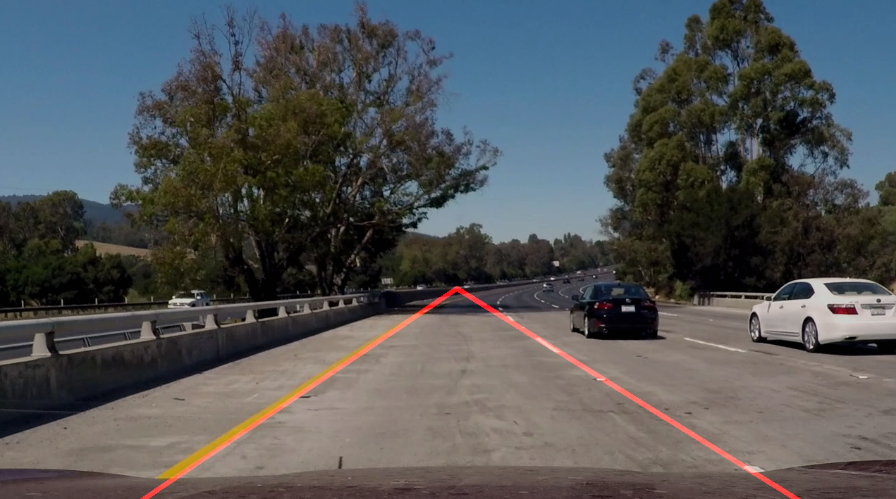

# Simple Lane Detection

A simple and naive python implementation of driving lane detection using Hough Transform for an image processing course.



The repository includes 3 raw video examples and 3 results of running the detection on this examples.

## Dependencies
Python3, Numpy and OpenCV

## Usage

Run one of the examples (or use your own video):

```sh
python lane_detector.py road-1.mp4
python lane_detector.py road-2.mp4
python lane_detector.py road-3.mp4
```